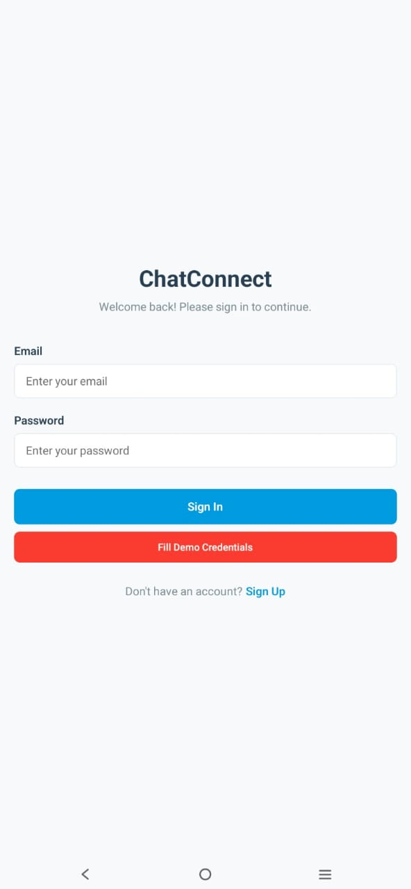
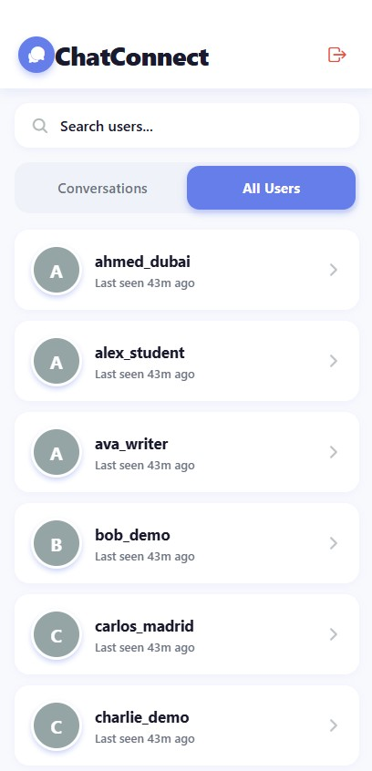
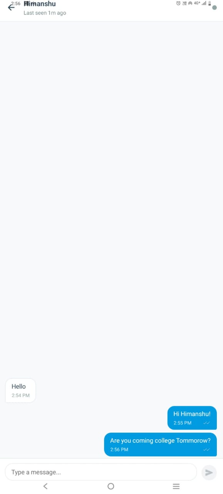
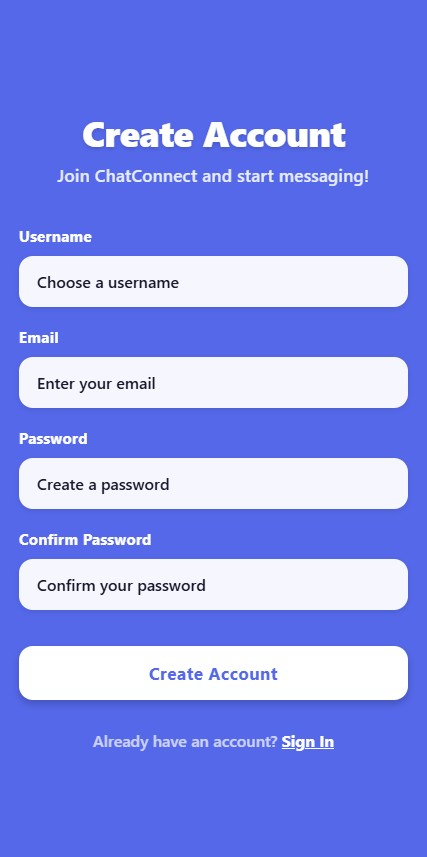

# ChatConnect - Real-time 1:1 Chat Application

A professional-grade real-time chat application built with React Native (frontend) and Node.js + Socket.IO (backend).

## 🚀 NEW: Premium UI & 5x Performance Boost!
ChatConnect has been enhanced with a **premium modern design** and **major performance optimizations**. See [`ENHANCEMENTS.md`](./ENHANCEMENTS.md) for details.

**Key Improvements:**
- ⚡ **5x faster** message delivery and loading times
- 🎨 **Premium modern UI** with purple gradient theme
- 👥 **30 diverse demo users** (up from 5)
- 📱 **Smooth 60 FPS** scrolling and animations
- 💎 **Enterprise-grade** visual design

Quick start: [`QUICK_START_ENHANCED.md`](./QUICK_START_ENHANCED.md)

## 📱 Screenshots

### App Interface
| Login Screen | User List |
|--------------|-----------|
|  |  |

### Chat & Registration
| Chat Interface | Registration |
|----------------|--------------|
|  |  |

## 🔗 Live Backend API
**Backend URL:** https://chatconnect-app-j8zm.onrender.com/api

### Demo Login Details
- **Email:** alice@chatconnect.demo
- **Password:** password123
- **Alternative accounts:** bob@chatconnect.demo, charlie@chatconnect.demo, diana@chatconnect.demo, evan@chatconnect.demo

## 🎥 Demo Video

📹 **[Watch Demo Video](https://drive.google.com/file/d/19-fucab8qt__UG12QbpRpL7W2bXmA9U0/preview)** 
> *Click to play directly in browser - no download required*
- All features demonstrated
- Real-time messaging showcase

## 🚀 Features

### Core Features
- **JWT Authentication** - Secure user registration and login
- **Real-time Messaging** - Instant message delivery using Socket.IO
- **User Management** - View all users and their online/offline status
- **Conversation History** - Persistent message storage with MongoDB
- **Typing Indicators** - See when someone is typing
- **Message Receipts** - Delivery and read status indicators
- **Online Presence** - Real-time user status updates

### Technical Highlights
- **Professional UI/UX** - Modern, clean interface design
- **Scalable Architecture** - Well-structured codebase with separation of concerns
- **Error Handling** - Comprehensive error handling and user feedback
- **Security** - Password hashing, JWT tokens, input validation
- **Real-time Communication** - WebSocket-based instant messaging
- **Cross-platform** - React Native app works on iOS and Android

## 🏗️ Architecture

```
┌─────────────────┐    ┌─────────────────┐    ┌─────────────────┐
│   Mobile App    │───▶│   Express API   │───▶│    MongoDB      │
│  (React Native) │    │   + Socket.IO   │    │   Database      │
└─────────────────┘    └─────────────────┘    └─────────────────┘
```

## 📁 Project Structure

```
newai/
├── mobile/                 # React Native frontend
│   ├── src/
│   │   ├── config/        # API configuration
│   │   ├── context/       # React contexts (Auth)
│   │   ├── navigation/    # Navigation setup
│   │   ├── screens/       # App screens
│   │   └── services/      # Socket.IO service
│   ├── App.js            # Main app component
│   ├── package.json      # Dependencies
│   └── app.json          # Expo configuration
├── server/                # Node.js backend
│   ├── config/           # Database configuration
│   ├── middleware/       # Auth & validation middleware
│   ├── models/           # MongoDB models
│   ├── routes/           # API routes
│   ├── scripts/          # Utility scripts
│   ├── socket/           # Socket.IO handlers
│   ├── server.js         # Main server file
│   └── package.json      # Dependencies
├── PRD.md                # Product Requirements Document
└── README.md             # This file
```

## 🛠️ Prerequisites

Before running this application, make sure you have:

- **Node.js** (v16 or higher) - [Download](https://nodejs.org/)
- **MongoDB** - [Download](https://www.mongodb.com/try/download/community) or use [MongoDB Atlas](https://www.mongodb.com/cloud/atlas)
- **Expo CLI** - `npm install -g expo-cli`
- **Git** - [Download](https://git-scm.com/)

## 🚀 Quick Start

### 1. Clone the Repository

```bash
git clone <your-repo-url>
cd newai
```

### 2. Backend Setup

```bash
# Navigate to server directory
cd server

# Install dependencies
npm install

# Copy environment file
cp .env.example .env

# Edit .env file with your configurations
# Make sure MongoDB is running on mongodb://localhost:27017/chatconnect

# Seed demo users (optional but recommended)
npm run seed

# Start the server
npm run dev
```

The server will start on `http://localhost:3000`

### 3. Frontend Setup

```bash
# Navigate to mobile directory (in a new terminal)
cd mobile

# Install dependencies
npm install

# Start the Expo development server
npm start
```

### 4. Run the App

- **iOS Simulator**: Press `i` in the Expo CLI
- **Android Emulator**: Press `a` in the Expo CLI  
- **Physical Device**: Scan QR code with Expo Go app

## 🔧 Configuration

### Backend Environment Variables (.env)

```env
# Server Configuration
PORT=3000
NODE_ENV=development

# Database Configuration
MONGODB_URI=mongodb://localhost:27017/chatconnect

# JWT Configuration
JWT_SECRET=your_super_secret_jwt_key_here
JWT_EXPIRES_IN=7d
JWT_REFRESH_EXPIRES_IN=30d

# CORS Configuration
ALLOWED_ORIGINS=http://localhost:3000,http://localhost:19006
```

### Frontend Configuration

Update `mobile/src/config/api.js` and `mobile/.env` if your backend runs on a different URL:

```env
API_BASE_URL=http://localhost:3000/api
SOCKET_URL=http://localhost:3000
```

## 👥 Demo Users

The app comes with pre-seeded demo users for testing:

| Username | Email | Password |
|----------|-------|----------|
| alice_demo | alice@chatconnect.demo | password123 |
| bob_demo | bob@chatconnect.demo | password123 |
| charlie_demo | charlie@chatconnect.demo | password123 |
| diana_demo | diana@chatconnect.demo | password123 |
| evan_demo | evan@chatconnect.demo | password123 |

**To seed demo users:**
```bash
cd server
npm run seed
```

## 📱 How to Use

### 1. Authentication
- **Register**: Create a new account with username, email, and password
- **Login**: Sign in with email and password
- **Demo**: Use "Fill Demo Credentials" button for quick testing

### 2. User List
- View all registered users
- See online/offline status (green/gray indicators)
- Switch between "Conversations" and "All Users" tabs
- Search users by username or email

### 3. Chat Features
- **Send Messages**: Type and send real-time messages
- **Typing Indicators**: See when someone is typing
- **Message Status**: 
  - Single checkmark = Delivered
  - Double checkmark = Read
- **Online Status**: See if the other user is online
- **Message History**: All messages are saved and loaded automatically

## 🔌 API Endpoints

### Authentication
- `POST /api/auth/register` - User registration
- `POST /api/auth/login` - User login
- `POST /api/auth/refresh` - Refresh JWT token
- `GET /api/auth/me` - Get current user
- `POST /api/auth/logout` - Logout user

### Users & Messages
- `GET /api/users` - Get all users
- `GET /api/users/conversations` - Get user conversations
- `GET /api/users/:userId/messages` - Get conversation messages
- `POST /api/users/:userId/messages` - Send message (fallback)

### Health Check
- `GET /health` - Server health status

## 🔌 Socket Events

### Client → Server
- `join_conversation` - Join conversation room
- `message:send` - Send new message
- `typing:start` - Start typing indicator
- `typing:stop` - Stop typing indicator
- `message:read` - Mark message as read

### Server → Client
- `message:new` - Receive new message
- `message:sent` - Message sent confirmation
- `typing:start` - User started typing
- `typing:stop` - User stopped typing
- `user:online` - User came online
- `user:offline` - User went offline
- `message:read` - Message read confirmation

## 🧪 Testing

### Manual Testing Checklist

**Authentication:**
- [ ] Register new user
- [ ] Login with valid credentials
- [ ] Login with invalid credentials
- [ ] Auto-login on app restart

**Real-time Messaging:**
- [ ] Send message between two users
- [ ] Receive messages instantly
- [ ] Message delivery indicators
- [ ] Message read receipts

**User Presence:**
- [ ] Online/offline status updates
- [ ] Typing indicators
- [ ] Last seen timestamps

**UI/UX:**
- [ ] Smooth navigation
- [ ] Responsive design
- [ ] Error handling
- [ ] Loading states

### Test with Multiple Devices

1. Run the app on multiple devices/simulators
2. Login with different demo users
3. Test real-time messaging between users
4. Verify online/offline status updates

## 🚀 Deployment

### 📋 Pre-Deployment Checklist

Before deploying to GitHub, ensure:
- [ ] All sensitive data is in `.env` files (not committed)
- [ ] `.env.example` files are created with template values
- [ ] `.gitignore` files are properly configured
- [ ] Code is tested and working locally

### 🔐 GitHub Deployment (Safe & Secure)

#### Step 1: Prepare Your Repository

1. **Initialize Git Repository**
   ```bash
   cd newai
   git init
   git add .
   git commit -m "Initial commit: ChatConnect real-time chat app"
   ```

2. **Create GitHub Repository**
   - Go to [GitHub.com](https://github.com) and create a new repository
   - Name it `chatconnect-app` or similar
   - **DO NOT** initialize with README (you already have one)
   - Keep it **Public** for easy sharing and collaboration

3. **Connect Local to GitHub**
   ```bash
   git remote add origin https://github.com/YOUR_USERNAME/chatconnect-app.git
   git branch -M main
   git push -u origin main
   ```

#### Step 2: Environment Variables Security

**⚠️ CRITICAL: Never commit these files:**
- `server/.env` (contains JWT secrets, MongoDB URI)
- `mobile/.env` (contains API URLs)

**✅ Safe to commit:**
- `server/.env.example` (template without real values)
- `mobile/.env.example` (template without real values)

#### Step 3: Repository Structure

Your GitHub repo will contain:
```
chatconnect-app/
├── .gitignore              ✅ Protects sensitive files
├── README.md               ✅ Complete documentation
├── PRD.md                  ✅ Product requirements
├── mobile/
│   ├── .env.example        ✅ Template for mobile config
│   ├── src/                ✅ All source code
│   └── package.json        ✅ Dependencies
└── server/
    ├── .env.example        ✅ Template for server config
    ├── models/             ✅ All source code
    ├── routes/             ✅ All source code
    └── package.json        ✅ Dependencies
```

#### Step 4: Clone & Setup Instructions for Others

Add this section to your README for easy setup:

```bash
# Clone the repository
git clone https://github.com/YOUR_USERNAME/chatconnect-app.git
cd chatconnect-app

# Backend setup
cd server
npm install
cp .env.example .env
# Edit .env with your MongoDB URI and JWT secrets
npm run seed
npm run dev

# Frontend setup (new terminal)
cd ../mobile
npm install
cp .env.example .env
# Edit .env with your backend URL
npm start
```

### 🌐 Production Deployment Options

#### Backend Deployment

**Option 1: Railway (Recommended)**
1. Connect GitHub repo to Railway
2. Set environment variables in Railway dashboard
3. Deploy automatically on push

**Option 2: Heroku**
1. Install Heroku CLI
2. `heroku create your-app-name`
3. Set config vars: `heroku config:set JWT_SECRET=your_secret`
4. `git push heroku main`

**Option 3: DigitalOcean App Platform**
1. Connect GitHub repo
2. Configure environment variables
3. Deploy with one click

#### Frontend Deployment

**Option 1: Expo Build Service**
```bash
cd mobile
expo build:android  # For Android APK
expo build:ios      # For iOS IPA
```

**Option 2: EAS Build (New Expo)**
```bash
npm install -g @expo/cli
eas build --platform android
eas build --platform ios
```

## 🔒 Security Features

- **Password Hashing** - bcrypt with salt rounds
- **JWT Authentication** - Secure token-based auth
- **Input Validation** - Joi schema validation
- **Rate Limiting** - Prevent abuse
- **CORS Configuration** - Secure cross-origin requests
- **Environment Variables** - Sensitive data protection

## 📊 Performance Optimizations

- **Database Indexing** - Optimized MongoDB queries
- **Connection Pooling** - Efficient database connections
- **Socket.IO Rooms** - Efficient real-time communication
- **React Native Optimization** - FlatList for message rendering
- **Caching** - AsyncStorage for offline data

## 🐛 Troubleshooting

### Common Issues

**Backend won't start:**
- Check if MongoDB is running
- Verify environment variables
- Check port availability (3000)

**Frontend connection issues:**
- Verify API_BASE_URL in config
- Check if backend is running
- Ensure devices are on same network

**Socket connection fails:**
- Check CORS configuration
- Verify JWT token validity
- Check network connectivity

**Messages not delivering:**
- Check Socket.IO connection
- Verify user authentication
- Check database connectivity

### Debug Mode

Enable debug logging:
```bash
# Backend
DEBUG=socket.io:* npm run dev

# Frontend
# Check Expo developer tools console
```

## 📝 Development Notes

### Code Quality
- **ESLint** - Code linting and formatting
- **Error Boundaries** - React error handling
- **TypeScript Ready** - Easy migration to TypeScript
- **Modular Architecture** - Scalable code organization

### Future Enhancements
- Group chat functionality
- Media sharing (images, files)
- Push notifications
- Message encryption
- User blocking/reporting
- Dark mode theme
- Voice messages

## 👨‍💻 Developer Information

**Author:** Himanshu  
**Tech Stack:** React Native, Node.js, Express, Socket.IO, MongoDB  
**Features:** Real-time messaging, JWT authentication, user presence tracking

## 📄 License

This project demonstrates modern full-stack development practices.

---


**🎉 Congratulations! You now have a fully functional, professional-grade chat application!**
